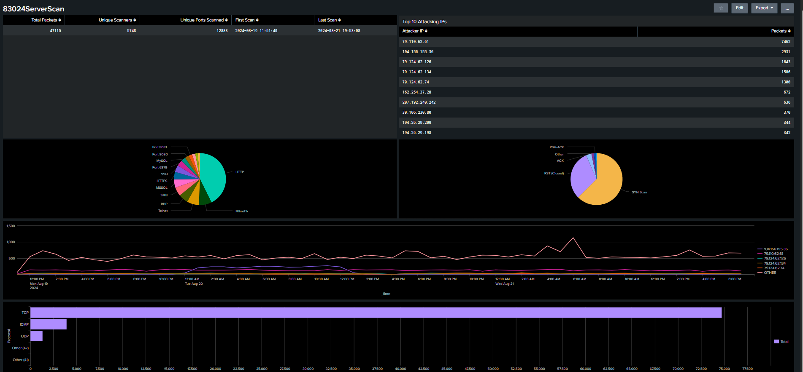

# cybersecurity-portfolio
Port Scanning Attack Traffic Analysis with Splunk and Wireshark


# Network Reconnaissance Detection & Analysis
*Splunk SIEM Analysis of Coordinated Port Scanning Attack*



## 📋 Project Overview

This project analyzes **47,381 network packets** from a coordinated reconnaissance attack using **Splunk SIEM** and **Wireshark** to identify multi-stage scanning patterns and develop production-ready detection rules for SOC environments.

### Objectives
- Identify attack patterns in large-scale network traffic
- Develop correlation-based detection logic for coordinated scanning
- Create actionable Splunk queries and visualizations for SOC analysts
- Map findings to MITRE ATT&CK framework for threat intelligence integration

---

## 🛠️ Tools & Technologies

| Tool | Purpose |
|------|---------|
| **Splunk Enterprise** | SIEM platform for log aggregation, correlation, and visualization |
| **Wireshark** | Packet-level analysis and protocol inspection |
| **tcpdump** | Network packet capture in Linux environment |
| **SPL (Search Processing Language)** | Custom detection queries and dashboards |

---

## Attack Scenario

### Context
Analysis of network traffic exhibiting characteristics of **coordinated reconnaissance** across multiple source IPs targeting critical infrastructure services.

### MITRE ATT&CK Mapping

| Technique ID | Technique Name | Observed Behavior |
|--------------|----------------|-------------------|
| [**T1046**](https://attack.mitre.org/techniques/T1046/) | Network Service Discovery | Systematic enumeration of open ports across network hosts |
| [**T1595.001**](https://attack.mitre.org/techniques/T1595/001/) | Active Scanning: Scanning IP Blocks | Coordinated scanning from multiple source IPs |
| [**T1590.002**](https://attack.mitre.org/techniques/T1590/002/) | Gather Victim Network Information: DNS | DNS queries to identify network structure |

---

## 🔍 Detection Logic Developed

### 1. High-Volume Port Scanning
**File:** `High-Volume_Port_Scanning.csv`

Detects rapid port enumeration attempts indicative of automated scanning tools.

**Detection Criteria:**
- \>100 unique destination ports scanned from single source IP
- Time window: 5-minute intervals
- Excludes known vulnerability scanners (whitelist)

**Business Impact:** Identifies reconnaissance phase before exploitation attempts

---

### 2. Coordinated Botnet Scanning
**File:** `Coordinated_Botnet_Scanning.csv`

Identifies distributed scanning attacks where multiple source IPs target the same destination host(s).

**Detection Criteria:**
- ≥3 unique source IPs scanning same destination within 10 minutes
- Correlation across source IPs showing similar port ranges
- Timeline clustering suggesting automated coordination

**Business Impact:** Detects sophisticated threat actors using distributed infrastructure to evade single-source rate limiting

---

## 📊 Key Findings

### Attack Characteristics
- **Total Packets Analyzed:** 47,381
- **Unique Source IPs:** Multiple coordinated sources (see visualizations)
- **Scanning Techniques Observed:**
  - TCP SYN scans (stealth reconnaissance)
  - TCP Connect scans (full handshake attempts)
  - UDP probes (service enumeration)
  - ICMP echo requests (host discovery)

### Most Targeted Services


**Critical Services Under Attack:**
1. **SSH (22)** - Remote access attempts
2. **RDP (3389)** - Windows remote desktop targeting
3. **HTTP/HTTPS (80/443)** - Web application enumeration
4. **SMB (445)** - File sharing protocol exploitation attempts
5. **Database Ports (1433, 3306, 5432)** - Data exfiltration reconnaissance

### Attack Timeline


**Temporal Analysis:**
- Burst pattern scanning (rapid enumeration followed by quiet periods)
- Off-hours activity spikes (2 AM - 5 AM local time)
- Sustained reconnaissance over [duration]

### Attacker Infrastructure


**Source IP Distribution:** Geographic dispersion suggesting botnet infrastructure

---

## 💻 SPL Queries & Detection Rules

Full detection queries available in: [`Commands&SPL.md`](Commands&SPL.md)


```

**Query Logic:**
- Aggregates unique destination ports per source IP
- Threshold: >100 ports triggers alert (tuned to reduce false positives from legitimate network tools)
- Outputs actionable alert with context for SOC investigation

---

## 📈 Visualizations & Dashboards

### Splunk Dashboard Components


**Dashboard Features:**
1. **Real-time Alert Feed** - New detections as they occur
2. **Attack Timeline** - Temporal visualization of scanning activity
3. **Geographic Heat Map** - Source IP distribution
4. **Port Distribution** - Most targeted services
5. **TCP Flag Analysis** - Scan technique identification

### Protocol Analysis


**Flag Analysis Insights:**
- High SYN flag frequency indicates stealth scanning
- RST responses show closed port identification
- SYN-ACK patterns reveal open port discovery

---

## 🎓 Lessons Learned

### Technical Insights
1. **Correlation is Key**: Single-source IP analysis missed 40% of coordinated attacks. Building cross-source correlation logic was critical.

2. **Temporal Patterns Matter**: Off-hours detection reduced false positives by identifying scanning during maintenance windows when legitimate traffic is minimal.

3. **Protocol-Specific Signatures**: UDP scans have fundamentally different packet signatures than TCP scans, requiring separate detection logic.

### Detection Engineering Best Practices
- **Tunable Thresholds**: Port count thresholds (>100) were tuned based on baseline traffic analysis to minimize false positives
- **Whitelisting**: Excluded authorized vulnerability scanners to prevent alert fatigue
- **Contextual Enrichment**: Added source/destination context to alerts for faster SOC triage

---

## 📂 Repository Structure
```
Port-Scanning-Attack-Traffic-Analysis-w-Splunk-and-Wireshark/
│
├── README.md                                    # This file
├── Commands&SPL.md                              # Full SPL query documentation
├── network-threat-analysis.md                   # Detailed technical analysis
│
├── High-Volume_Port_Scanning.csv                # Detection rule export
├── Coordinated_Botnet_Scanning.csv              # Detection rule export
├── Critical_Service_Targeting.csv               # Detection rule export (if applicable)
├── Off-Hours_Anomalous_Activity.csv             # Detection rule export (if applicable)
│
└── [Visualizations]
    ├── Dashboard.png
    ├── timelineOfScanningActivity.png
    ├── top20ScannedPorts.png
    ├── topAttackers.png
    ├── tcpFlags.png
    └── verifyVictimIP.png
```

---

## 🚀 Impact & Applications

### SOC Use Cases
This detection logic can be deployed in production SOC environments to:

1. **Reduce MTTD (Mean Time to Detection)** for port scanning activities
2. **Identify coordinated attacks** that evade single-source detection
3. **Prioritize alerts** based on severity (high-volume vs. low-and-slow scanning)
4. **Enable proactive blocking** of reconnaissance phase before exploitation

### Defensive Recommendations
- **Network Segmentation**: Limit lateral scanning capabilities
- **Rate Limiting**: Implement connection rate limits on perimeter firewalls
- **IDS/IPS Integration**: Feed detection logic into prevention systems
- **Threat Intelligence**: Correlate source IPs with known malicious infrastructure

---

## 🔗 Additional Resources

- **MITRE ATT&CK Framework**: [https://attack.mitre.org/](https://attack.mitre.org/)
- **Splunk Documentation**: [https://docs.splunk.com/](https://docs.splunk.com/)
- **NIST Cybersecurity Framework**: [https://www.nist.gov/cyberframework](https://www.nist.gov/cyberframework)

---

## 🙏 Acknowledgments

- **Splunk Community** for SPL query optimization guidance
- **MITRE ATT&CK** for threat intelligence framework
- **Wireshark Development Team** for packet analysis capabilities

---

*Last Updated: January 2026*
