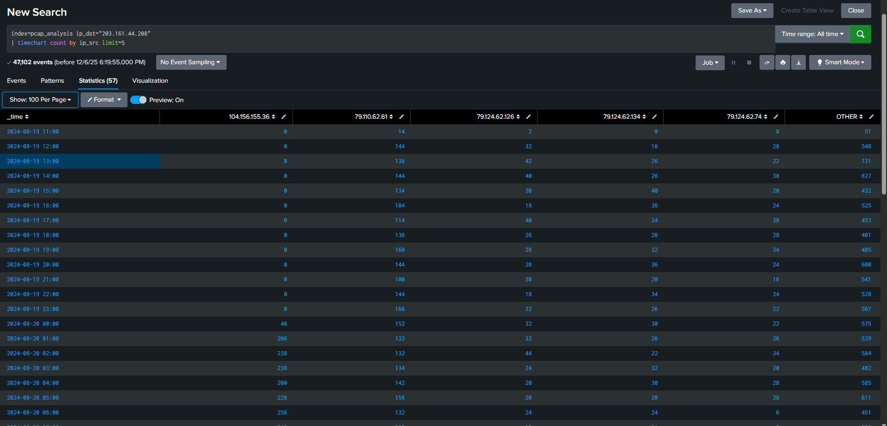
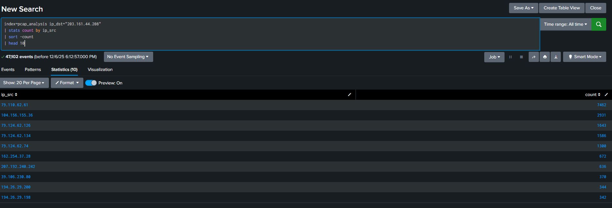
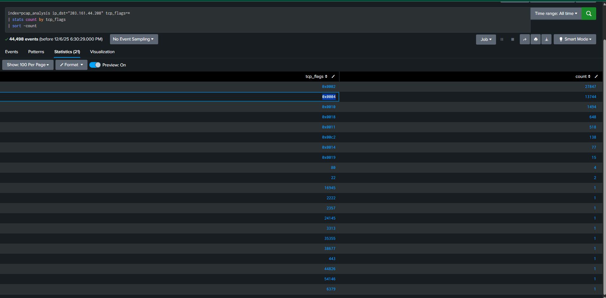
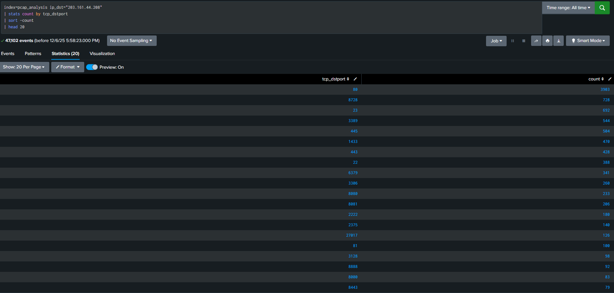

# Network Threat Analysis: An 11-Day Server Reconnaissance Campaign

**Project Summary** Analyze network traffic to identify and describe reconnaissance activities on a production server.

**Duration**: August 19–30, 2024 (11 days)

**Tools Used**: 
- Wireshark (for packet capture analysis).
- Splunk Enterprise (SIEM Analysis and Correlation).
- TCP/IP Protocol Analysis

## Methodology

### Investigation Steps
1. Imported PCAP files into Wireshark for initial analysis
   - TCP/IP analysis
   - Identified the victim server (203.161.44.208) receiving 47, 102 packets
   - Found primary attacker: 79.110.62.61 (7,462 packets)
   - Discovered coordinated botnet scanning from 79.124.62.0/24 subnet
   - Analyzed most targeted ports: HTTP, Telnet, RDP, SSH, MikroTik   
2. Imported PCAP files into Splunk for further analysis, visualization, and detection rule creatiion

## Key Findings
- **47,102 total packets** analyzed over 11 days
- **Primary attacker** sent 7,462 packets
- **20+ critical services** targeted including SSH (22), Telnet (23), RDP (3389)
- **SYN scanning** detected - attacker probing for open ports

### Detection Rules Created
I created 5 Splunk detection rules to identify:
1. High-volume port scanning (10+ ports in 5 minutes)
2. Coordinated botnet activity from same subnet
3. Critical service targeting (SSH, RDP, databases)
4. SYN flood attacks
5. Off-hours suspicious activity

## Visualizations

## Skills Demonstrated
- SIEM query writing (Splunk SPL)
- Network traffic analysis
- Threat detection and investigation
- Creating detection rules for security monitoring

## Mitigation Technique Recommendations
Based on this analysis, I would like to reccommend the identified threat IPs to be blocked, rate limiting on external services, as well as deploying my previously listed threat detection rules in the production SIEM. Additionally, the organization should also disable unecrypted ports e.g. Telnet (Port 23), enable multifactor authentication on SSH and RDP, and consider geo-blocking if international access is not required for business operations.

## Files
- `SPL_Queries.md` - All Splunk queries used
- 2024-08-30-approximately-11-days-of-server-scans-and-probes.pcap - Network capture file from https://malware-traffic-analysis.net/2024/08/30/index.html
- Screenshots showing analysis results

